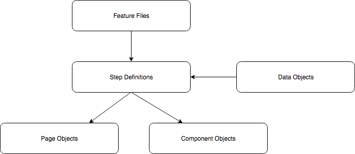

# Python Automation

## Overview

This framework is designed to help you quickly start with implementing automation within Your project. It's based on [Behave Framework](https://behave.readthedocs.io/) 
which facilitates [Behaviour Driven Development](https://en.wikipedia.org/wiki/Behavior-driven_development) principles with [Selenium for python](https://selenium-python.readthedocs.io/) 
which allows to mimic user actions on any given website. 

Framework structure goes as follows:

## Instalation

##### Prerequisites:
- Python 3.7 - [Installation](https://www.python.org/downloads/)
- PIP version 18.7 - [Installation](https://pip.pypa.io/en/stable/installing/)
- Chromedriver - [Installation](https://chromedriver.chromium.org/getting-started)
- Google Chrome - [Installation](https://www.google.com/chrome/)

##### Get repo
``
git clone https://bitbucket.org/Piorys/pythonautomation.git
``

## Execution

TODO

## Artifacts

TODO
